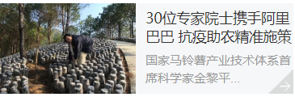
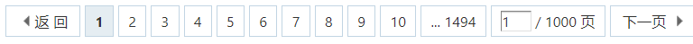
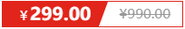

## HTML与CSS学习

> 这篇文章主要讲了定位，隐藏，精灵图，字体图标，CSS三角，鼠标样式，表单样式，vertical-align属性，溢出部分省略号显示和一些布局技巧
> 这篇笔记东西比较多也比较杂，希望以后能认真看完
> 这篇笔记是初学者写下的笔记，如有错误，欢迎前来指正

## CSS定位

- 实例：例如固定在屏幕两边的模块，或者是在盒子上显示的小模块
- 定位，把盒子定在某个位置
- 定位 = 定位模式 + 边偏移

### 定位模式

- 语法：

```css
div {
    position: static | relative | absolute | fixed ;
}
```

| 值       | 描述                |
| -------- | ------------------- |
| static   | 静态定位 **默认值** |
| relative | 相对定位            |
| absolute | 绝对定位            |
| fixed    | 固定定位            |

#### 静态定位 (static)

- 默认值，无定位 (标准流)

#### 相对定位 (relative)

- 移动位置时，是根据它原来的位置来移动的
- 和浮动不一样，原来的位置仍然占有，后面的盒子依然以标准流的方式对待它 (保留原来位置，标准流)
- 经常和绝对定位一起使用

#### 绝对定位 (absolute)

- 移动位置时，根据他的父元素的位置来移动
- 没有父元素或父元素没有定位，以浏览器为准
- 如果父级元素有定位(除了静态定位)，则会以最近一级带有定位的父级元素为准
- 例如：父元素没有定位，但爷爷元素有定位，那么定位会以爷爷元素为准
- 绝对定位不再占用原来的位置

#### 子绝父相

- 子绝父相：子元素用绝对定位，父盒子用相对定位来约束子元素定位(并且保留原来位置，不会影响布局)

#### 固定定位 (fixed)

- 不论页面如何滚动，这个元素一直在这
- 以浏览器的可视窗口作为坐标轴
- 固定定位不占用原来的位置
- 固定定位可以以版心对齐 (适用返回顶部的小模块)
  - 先左对齐，然后left: 50%;
  - 然后在用margin走版心宽度的一半

#### 粘性定位 (sticky)

- 使用场景：在某一位置开始变成固定定位
- 语法规范：

```css
div {
    position: sticky;
    top: 10px;
}
```

- 以可视窗口作为坐标轴
- 占有原来的位置
- 必须添加top、left、right、bottom其中一个
  - 例：top: 0;距离上沿0的时候开始变成固定定位

### 边偏移

| 值     | 描述                 |
| ------ | -------------------- |
| top    | 到父元素上边线的距离 |
| bottom | 到父元素下边线的距离 |
| left   | 到父元素左边线的距离 |
| right  | 到父元素右边线的距离 |

- 一个盒子既有left属性又有right属性 默认执行left属性(top和bottom默认执行top)

### 定位叠放次序 (z-index)

- 使用定位时，出现盒子层叠的情况，用z-index来控制摆放次序
- 语法规范：

```css
div {
    z-index: auto (默认值) | 正整数 | 0 | 负整数;
}
```

- 数值越大，盒子越靠上
- auto或者数值相同，后来者居上

### 定位的拓展

#### 绝对定位水平居中

- 绝对定位的盒子居中不能用margin: 0 auto;水平居中
- 解决办法：left: 50%; margin-left: 定位盒子宽度的一半;

#### 定位特殊特性

- 绝对定位和固定定位和浮动类似
  1. 可以设置高度和宽度
  2. 块元素加定位，不给大小的话默认是内容的大小
  3. 脱离标准流的盒子不会触发外边距合并的问题(塌陷)

#### 定位会完全压住盒子里面的内容

- 浮动只会压住下面标准流的盒子，但不会压住标准流里面的文字/图片
  - 浮动最早是做文字环绕效果的，所以文字不会挡住文字
- 绝对定位 (固定定位) 会完全压住盒子里面的内容

## 元素的显示与隐藏

- 让一个元素显示或隐藏

### display 隐藏

- 语法规范：

```css
div {
    display: none | block;
}
```

- none隐藏元素
- block除了可以转换成块元素还可以显示元素
- 注意：隐藏后的元素不占用原来的位置

### visibility 可见性

- 语法规范：

```css
div {
    visibility: visible | hidden;
}
```

- visible 可视，hidden隐藏
- 不同点：隐藏，但保留位置

### overflow 溢出部分隐藏

- 对溢出部分进行管理
- 语法规范：

```css
div {
    overflow: visible | auto | hidden | scroll;
}
```

- visible **默认值** 超出的部分显示出来
- auto 在需要的时候添加滚动条
- hidden 把多出来的部分隐藏
- scroll 一直显示滚动条
- 如果有用定位的盒子，慎用overflow: hidden，因为会隐藏超出的部分

## 精灵图

- 很多小图片会增多服务器请求次数，为了减少请求次数 --> css精灵技术

### 精灵技术使用 (sprite)

- 针对背景图片使用
- 使用的属性：背景图片的位置 (background-position)
- 网页中的坐标和数学里的不一样，所以一般情况下都是网上往左移动，所以数值都是负值

## 字体图标 (iconfont)

- 展示的是图标，但本质是一种字体
- 优点：比精灵图要小，可以灵活改变颜色，兼容性强
- 字体图标库下载[icomoon](http://icomoon.io/) [阿里iconfont](http://www.iconfont.cn/)
- 把fonts文件夹复制到网页根目录下
- 使用：

```html
<!-- 在下载的压缩包里的style.css文件里复制 @font-face声明 -->
<style>
    @font-face {
        font-family: 'icomoon';
        src:  url('fonts/icomoon.eot?dka4r');
        src:  url('fonts/icomoon.eot?dka4r#iefix') format('embedded-opentype'),
            url('fonts/icomoon.ttf?dka4r') format('truetype'),
            url('fonts/icomoon.woff?dka4r') format('woff'),
            url('fonts/icomoon.svg?dka4r#icomoon') format('svg');
        font-weight: normal;
        font-style: normal;
        font-display: block;
    }
    span {l
        /* 指定字体为@font-face里的font-family */
        font-family: 'iconmoon';
    }
</style>
<body>
    <!-- 在demo.html里找到图标下面的小方框''这就是要用的图标 -->
    <span></span>
</body>
```

### 字体图标追加

- 把selection.json文件重新上传，选中自己想要更新的图标，下载压缩包，替换原来的文件即可

## CSS三角

- 代码样例：

```html
<!-- 向右的箭头 -->
<style>
    div {
        width: 0px;
        height: 0px;
        border: 10px solid transparent;
        border-left: 10px solid blue;
        /* 下面两行为了照顾兼容性 */
        line-height: 0;
        font-size: 0;
    }
</style>
<body>
    <div></div>
</body>
```

- 一个盒子没有大小，但是有边框，四个边框以对角线划分整个盒子
- 所以就可以只指定一个方向有颜色，另外三个都没有颜色
- 开发时用定位来做盒子上面的小箭头
- 注意箭头方向移动的值为border宽度的二倍 (因为有一半是透明的)

## CSS用户界面样式

- 可以更改用户鼠标样式，表单轮廓，防止表单域拖拽

### 更改鼠标样式 (cursor)

- 语法规范：

```css
div {
    cursor: default | pointer | move | text | not-allowed;
}
```

| 属性值      | 描述   |
| ----------- | ------ |
| default     | 默认值 |
| pointer     | 小手   |
| move        | 移动   |
| text        | 文本   |
| not-allowed | 禁止   |

### 表单轮廓线 (outline)

- 去除文本框在被选中时出现的边框
- 语法规范：

```css
input {
    outline: none;
}
```

### 防止拖拽文本域 (resize)

- 防止用户在使用的时候改变文本域的大小
- 语法规范：

```css
textarea {
    resize: none;
}
```

- 文本域标签最好写在一行上，因为如果换行的话在文本域中的文本默认是在第二行开始的

## vertical-align属性

- 目的：设置图片或者表单元素和文字垂直对齐
- 针对行内元素和行内块元素有效
- 属性要写在图片(表单元素)上
- 语法规范：

```css
img {
    vertical-align: baseline | top | middle | bottom;
}
```

| 属性值   | 描述                          |
| -------- | ----------------------------- |
| baseline | **默认值** 快到最底下的一条线 |
| top      | 最顶端                        |
| middle   | 中间(图片和文字垂直居中)      |
| bottom   | 最底端                        |

### 解决图片下面有空白缝隙

- 空白缝隙是行内块元素和文字基线对齐产生的(例如f或p)
- 解决方法：
  - 给图片添加certical-align中除了baseline属性 (推荐)
  - 把图片转化为块级元素

## 溢出文字省略号显示

- 属性white-space
  - normal：如果文字显示不开自动换行
  - nowrap：不允许自动换行

```css
div {
    white-space: normal | nowrap;
}
```

- 属性text-overflow
  - ellipsis 文字溢出的时候用省略号显示

```css
div {
    text-overflow: ellipsis;
}
```

### 单行文本溢出

- 需要满足三个条件
  1. 强制一行显示文本 (white-space)
  2. 超出部分隐藏 (overflow)
  3. 文字用省略号代替超出部分 (text-overflow)

### 多行文本溢出

- 兼容性问题，适用于webkit浏览器，对IE没有作用

```css
div {
    overflow: hidden;
    text-overflow: ellipsis;
    /* 弹性伸缩盒子模型显示 */
    display: -webkit-box;
    /* 显示文本的行数 */
    -webkit-line-clamp: 2;
    /* 排列方式为垂直居中 */
    -webkit-box-orient: verical;
}
```

- 使用时要严格控制盒子大小
- 开发时经常后台来控制字数

## 布局技巧

### margin负值应用

- 有边框的盒子排列时会出现两个盒子之间的边框加粗的情况
- 给右面的盒子添加`margin-left: -1px;`右面的边框压住左面的边框，从而解决这个问题
- 把鼠标放在其中一个盒子上，盒子边框改变颜色
- 要是按照上面的方法改完的盒子会出现被压住的一边没有办法改变颜色的情况
- 解决方法：
  - 给要变色的盒子添加相对定位，然后盒子就会压住其他盒子
  - 如果盒子已经有定位则用z-index提高层级

### 文字围绕浮动元素

- 根据浮动不会压住文字的特性，既有图片又有文字只需要在左侧图片添加浮动，在大盒子里面写上文字就可以
- 代码实例：
  

```html
<style>
    .box {
        width: 300px;
        height: 100px;
        background-color: skyblue;
    }
    .pic {
        float: left;
    }
</style>
<body>
    <div class="box">
        <div class="pic">
            
        </div>
        <p></p>
    </div>
</body>
```

### 行内块元素布局

- 使用场景：网页下面的页码栏
- 行内块元素每个元素之间有个小缝隙
- 代码示例：(页码栏)
  

```html
<style>
    .box {
        text-align: center;
    }
    .box a {
        display: inline-block;
        width: 36px;
        height: 36px;
        background-color: #f7f7f7;
        border: 1px solid #ccc;
        text-align: center;
        line-height: 36px;
        text-decoration: none;
        color: #333;
    }
    .box .button {
        width: 85px;
    }
    .box input{
        height: 36px;
        width: 45px;
        border: 1px solid #ccc;
        outline: none;
    }
    .box button {
        width: 60px;
        height: 36px;
        background-color: #f7f7f7;
        border: 1px solid #ccc;
    }
</style>
<body>
    <div class="box">
        <a herf="#" class="button">&lt;&lt;</a>
        <a herf="#">2</a>
        <a herf="#">3</a>
        <a herf="#">4</a>
        <a herf="#">5</a>
        <a herf="#">6</a>
        <a herf="#" class="button">&gt;&gt;</a>
        到第
        <input type="text">
        页
        <button>确定</button>
    </div>
</body>
```

### CSS三角强化

- 实现效果：



- 代码示范：

```html
<style>
    /* 这一部分是生成三角形 */
    .trangle {
        width: 0;
        height: 0;
        border-top: 100px solid transparent;
        border-right: 50px solid skyblue;
        border-bottom: 0;
        border-left: 0;
    }
    /* 这一部分是生成京东价格标签案例 */
    .price {
        width: 160px;
        height: 24px;
        border: 1px solid red;
        line-height: 24px;
    }
    .now-price {
        position: relative;
        right:0;
        top: 0;
        float: left;
        width: 90px;
        height: 100%;
        background-color: red;
        text-align: center;
        color: #fff;
        font-weight: 700;
    }
    /* 下面制作三角方法更简单 */
    .now-price i {
        position: absolute;
        width: 0;
        height: 0;
        border-color: transparent red transparent transparent;
        border-style: solid;
        border-width: 24px 10px 0 0;
    }
</style>
<body>
    <div class="triangle"></div>
    <div class="price">
        <span class="now-orice">
            <i></i>
        </span>
        <span class="old-price"></span>
    </div>
</body>
```

- 把上面宽度调大
- 左面和下面的宽度调为零

### CSS初始化

- 为了消除不同浏览器对html的影响
- 京东初始化代码：

```css
* {
    margin: 0;
    padding: 0;
}

em,
i {
    /* 清除斜体 */
    font-style: normal;
}

li {
    list-style: none;
}

img {
    /* 为了兼容低版本浏览器，否则在图片上有链接的话会出现边框(和图片周围文字一个原理) */
    border: 0;
    vertical-align: middle;
}

button {
    /* 否则button上不会出现小手 */
    cursor: pointer;
}

a {
    color: #666;
    text-decoration: none;
}

a:hover {
    color: #c81623;
}

button,
input {
    font-family: Microsoft YaHei, Heiti SC, tahoma, arial, Hiragino Sans GB, "\5B8B\4F53", sans-serif;
    /* \5B8B\4F53 的意思是宋体，写汉字的话容易出现乱码 */
}

body {
    -webkit-font-smoothing: antialiased;
    background-color: #fff;
    font: 12px/1.5 Microsoft YaHei, Heiti SC, tahoma, arial, Hiragino Sans GB, "\5B8B\4F53", sans-serif;
    color: #666;
}

.hide,
.none {
    display: none;
    /* 隐藏 */
}

/* 清除浮动 */
.clearfix:after {
    visibility: hidden;
    clear: both;
    display: block;
    content: ".";
    height: 0;
}

.clearfix {
    *zoom: 1;
}
```