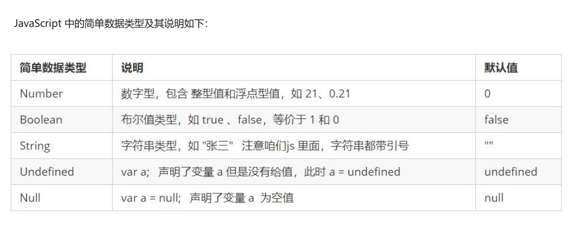
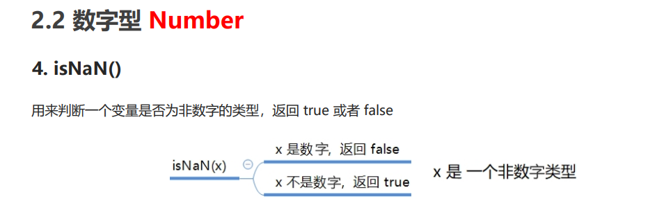

### 第一课时 入门基础

------

#### **知识点**：

------

- 操作系统就是个应用程序

- 只要是应用程序都要占用物理内存

- 浏览器本身也是一个应用程序

- 浏览器本身只懂得解析`HTML`

- 调用浏览器这个应用程序的一个功能绘制

  

#### 1、javascript介绍

------

- `JavaScript`操作`DOM`的本质是=获取+触发+改变
- 目的：就是用来操作内存中的`DOM`节点
  - 修改`DOM`节点的属性
  - 过`javascript`语法组织逻辑代码操作DOM
  - `BOM(window)`它包含了`DOM`
  - `DOM(document)`
  - `script`脚本推荐放在最下边好处：防止因网络问题，页面加载时间长，出现空白；即便网络问题，浏览器也把`DOM`加载渲染完成，等待从服务端下载完`js`脚本，出现效果
  - `css`不放在最下面原因通俗地讲：好比先穿好衣服在出去，浏览器先把`css`样式准备好，在加载结构层，使得页面有样子；如果放在下面，因为页面是从上往下加载，没有`css`，就剩下裸露的标签，很难看，使得用户体验不好

* 代码展示
  * 输入，输出，打印语句

```js
// 这是一个输入框
prompt('请输入您的年龄');
// alert 弹出警示框 输出的 展示给用户的
alert('计算的结果是');
// console 控制台输出 给程序员测试用的  
console.log('我是程序员能看到的');				
```


#### 2、基于对象的内存管理

------

- ```
  javascript
  ```

  就是来操作这些对象

  - 通过逻辑组织对象之间的关系和行为
  - 如何操作这些对象？通过变量引用

#### 3、变量

------

- 变量本质是一个空盒子，里面记录了一个内存地址，使能找到内存中的对象，保存了指向具体的实在的东西的地址
- 变量存在栈中，对象存在堆中
- 变量的意义：方便我们去操作对象
- 变量的几种引用方式
  - 指针（`C`语言中叫法）
  - 引用（`Java`）
  - 变量
- 例如
  - `var b = document.body` 含义：把`body`这个对象在内存中的地址放到b变量里面，变量`b`（`b`是内存地址的别名）本身也存在内存中，以后的操作是针对`body`这个地址

- 变量命名规范
  - 由字母(`a-zA-Z`)数字(`0-9`)下划线(`_`)以及美元符号(`$`)
  - 不能由数字开头
  - 命名尽量用英文并且具有一定的含义
  - 如果有多个英文单词,后面单词的首字母大写
  - 不能使用关键字
  - 首字母不要大写，大写是有特殊含义的

- 案例一 

```js
// 1. 声明了一个age 的变量 
var age;
// 2. 赋值  把值存入这个变量中
age = 18;
// 3. 输出结果 
console.log(age);
// 4. 变量的初始化 
var myname = 'pink老师';
console.log(myname);
```

- 案例二（弹出用户名）


```js
// 1. 用户输入姓名  存储到一个 myname的变量里面
var myname = prompt('请输入您的名字');
// 2. 输出这个用户名
alert(myname);
```

- 案例三 （交换两个变量值）

```js
  // js 是编程语言有很强的逻辑性在里面： 实现这个要求的思路 先怎么做后怎么做 
  // 1. 我们需要一个临时变量帮我们
  // 2. 把apple1 给我们的临时变量 temp 
  // 3. 把apple2 里面的苹果给 apple1 
  // 4. 把临时变量里面的值 给 apple2 
  var temp; // 声明了一个临时变量为空
  var apple1 = '青苹果';
  var apple2 = '红苹果';
  temp = apple1; // 把右边给左边
  apple1 = apple2;
  apple2 = temp;
  console.log(apple1);
  console.log(apple2);
```

#### 4、数据类型简介

##### 4.1 变量的数据类型

- 变量是用来存储值的所在处，它们有名字和数据类型。变量的数据类型决定了如何将代表这些值的位存储到计算机的 内存中。JavaScript 是一种弱类型或者说动态语言。这意味着不用提前声明变量的类型，在程序运行过程中，类型会 被自动确定。

```js
var age = 10; // 这是一个数字型
var areYouOk = '是的'; // 这是一个字符串
```


- 在代码运行时，变量的数据类型是由 JS引擎 根据 = 右边变量值的数据类型来判断 的，运行完毕之后， 变量就确定了数据类型。 JavaScript 拥有动态类型，同时也意味着相同的变量可用作不同的类型：

```js
var x = 6; // x 为数字
var x = "Bill"; // x 为字符串 
```

##### 4.2 数据类型的分类

- 简单数据类型 （Number,String,Boolean,Undefined,Null）
- 复杂数据类型 （object)

#### 5、简单数据类型



##### 5.1 数字型Number

```js
var num = 10; // num 数字型 
var PI = 3.14 // PI 数字型
// 1. 八进制  0 ~ 7  我们程序里面数字前面加0 表示八进制
var num1 = 010;
console.log(num1); //  010  八进制 转换为 10进制 就是  8 
var num2 = 012;
console.log(num2);
// 2. 十六进制  0 ~ 9  a ~ f    #ffffff  数字的前面加 0x 表示十六进制
var num3 = 0x9;
console.log(num3);
var num4 = 0xa;
console.log(num4);
// 3. 数字型的最大值
console.log(Number.MAX_VALUE);
// 4. 数字型的最小值
console.log(Number.MIN_VALUE);
// 5. 无穷大
console.log(Number.MAX_VALUE * 2); // Infinity 无穷大  
// 6. 无穷小
console.log(-Number.MAX_VALUE * 2); // -Infinity 无穷大
// 7. 非数字
console.log('pink老师' - 100); // NaN
```



```js
// isNaN() 这个方法用来判断非数字   并且返回一个值 如果是数字返回的是 false 如果不是数字返回的是true
console.log(isNaN(12)); // false
console.log(isNaN('pink老师')); // true
```

##### 5.2 字符串型String

```js
// 1. 检测获取字符串的长度 length 
var str = 'my name is andy';
console.log(str.length); // 15
// 2. 字符串的拼接 +  只要有字符串和其他类型相拼接 最终的结果是字符串类型
console.log('沙漠' + '骆驼'); // 字符串的 沙漠骆驼
console.log('pink老师' + 18); // 'pink老师18'
console.log('pink' + true); // pinktrue
console.log(12 + 12); // 24
console.log('12' + 12); // '1212'
```

##### 5.3 布尔型Boolean

``` js
var flag = true; // flag 布尔型 
var flag1 = false; // flag1 布尔型
console.log(flag + 1); // true 参与加法运算当1来看
console.log(flag1 + 1); // false 参与加法运算当 0来看
// 如果一个变量声明未赋值 就是 undefined 未定义数据类型
var str;
console.log(str);
var variable = undefined;
console.log(variable + 'pink'); // undefinedpink
console.log(variable + 1); // NaN  undefined 和数字相加 最后的结果是 NaN
// null 空值
var space = null;
console.log(space + 'pink'); // nullpink
console.log(space + 1); // 1
```

##### 5.4 获取变量数据类型

```js
var num = 10;
console.log(typeof num); // number
var str = 'pink';
console.log(typeof str); // string
var flag = true;
console.log(typeof flag); // boolean
var vari = undefined;
console.log(typeof vari); // undefined
var timer = null;
console.log(typeof timer); // object
// prompt 取过来的值是 字符型的
var age = prompt('请输入您的年龄');
console.log(age);
console.log(typeof age);
```

##### 5.5 字面量

```js
console.log(18);
console.log('18');
console.log(true);
console.log(undefined);
console.log(null);
```

##### 5.6 转换为字符型

```js
var num = 10;
var str = num.toString();
console.log(str);
console.log(typeof str);
// 2. 我们利用 String(变量)   
console.log(String(num));
// 3. 利用 + 拼接字符串的方法实现转换效果 隐式转换
console.log(num + '');
```

5.7 转换为数字型

```js
// var age = prompt('请输入您的年龄');
// 1. parseInt(变量)  可以把 字符型的转换为数字型 得到是整数
// console.log(parseInt(age));
console.log(parseInt('3.14')); // 3 取整
console.log(parseInt('3.94')); // 3 取整
console.log(parseInt('120px')); // 120 会去到这个px单位
console.log(parseInt('rem120px')); // NaN
// 2. parseFloat(变量) 可以把 字符型的转换为数字型 得到是小数 浮点数
console.log(parseFloat('3.14')); // 3.14
console.log(parseFloat('120px')); // 120 会去掉这个px单位
console.log(parseFloat('rem120px')); // NaN
// 3. 利用 Number(变量) 
var str = '123';
console.log(Number(str));
console.log(Number('12'));
// 4. 利用了算数运算 -  *  /  隐式转换
console.log('12' - 0); // 12
console.log('123' - '120');
console.log('123' * 1);
```

5.8 转换为布尔型

```js
console.log(Boolean('')); // false
console.log(Boolean(0)); // false
console.log(Boolean(NaN)); // false
console.log(Boolean(null)); // false
console.log(Boolean(undefined)); // false
console.log('------------------------------');
console.log(Boolean('123'));
console.log(Boolean('你好吗'));
console.log(Boolean('我很好'));
```

#### 6、循环

##### 6.1 for执行过程

```js
// 1. for 重复执行某些代码， 通常跟计数有关系
// 2. for 语法结构
// for (初始化变量; 条件表达式; 操作表达式) {
//     // 循环体
// }
// 3. 初始化变量 就是用var 声明的一个普通变量， 通常用于作为计数器使用 
// 4. 条件表达式 就是用来决定每一次循环是否继续执行 就是终止的条件
// 5. 操作表达式 是每次循环最后执行的代码 经常用于我们计数器变量进行更新（递增或者递减）
// 6. 代码体验 我们重复打印100局 你好
for (var i = 1; i <= 100; i++) {
    console.log('你好吗');
}
```

```js
// for 循环的执行过程
for (var i = 1; i <= 100; i++) {
    console.log('你好吗');
}
// 1. 首先执行里面的计数器变量  var i = 1 .但是这句话在for 里面只执行一次  index
// 2. 去 i <= 100 来判断是否满足条件， 如果满足条件  就去执行 循环体  不满足条件退出循环 
// 3. 最后去执行 i++   i++是单独写的代码 递增  第一轮结束 
// 4. 接着去执行 i <= 100 如果满足条件  就去执行 循环体  不满足条件退出循环   第二轮
```

##### 6.2 双重for循环

```js
// 1. 双重for循环 语法结构
// for (外层的初始化变量; 外层的条件表达式; 外层的操作表达式) {
//     for (里层的初始化变量; 里层的条件表达式; 里层的操作表达式) {
//         // 执行语句;
//     }
// }
// 2. 我们可以把里面的循环看做是外层循环的语句
// 3. 外层循环循环一次， 里面的循环执行全部
// 4. 代码验证
for (var i = 1; i <= 3; i++) {
    console.log('这是外层循环第' + i + '次');
    for (var j = 1; j <= 3; j++) {
        console.log('这是里层的循环第' + j + '次');

    }
}
```

##### 6.3 while循环

```js
// 1. while 循环语法结构  while 当...的时候
// while (条件表达式) {
//     // 循环体
// }
// 2. 执行思路  当条件表达式结果为true 则执行循环体 否则 退出循环
// 3. 代码验证
var num = 1;
while (num <= 100) {
    console.log('好啊有');
    num++;
}
// 4. 里面应该也有计数器 初始化变量
// 5. 里面应该也有操作表达式  完成计数器的更新 防止死循环
```

##### 6.4 do whild循环

```js
// 1.do while 循环 语法结构
do {
    // 循环体
} while (条件表达式)
    // 2.  执行思路 跟while不同的地方在于 do while 先执行一次循环体 在判断条件 如果条件表达式结果为真，则继续执行循环体，否则退出循环
    // 3. 代码验证
    var i = 1;
do {
    console.log('how are you?');
    i++;
} while (i <= 100)
    // 4. 我们的do while 循环体至少执行一次
```

##### 6.5 break

```js
for (var i = 1; i <= 5; i++) {
    if (i == 3) {
        break;
    }
    console.log('我正在吃第' + i + '个包子');
}
```

- 案例

```js
1.====================================
    var num = 0;
for (var i = 1; i <= 100; i++) {
    num = num + i;
}
console.log(num);
console.log(num/i);
2.====================================
    var num = 0
for (var i = 1; i <= 100; i++) {
    if (i % 2 == 0) {
        num = num + i;
    }
}
console.log(num);
3.=======================================
    var str = ''
for (var i = 1; i <= 5; i++) {
    for (var j = 1; j <= 5; j++) {
        str = str + '★';
    }
    str = str + '\n';
} 
console.log(str);
4.=======================================
    var str = ''
for (var i = 1; i <= 5; i++) {
    for (var j = 1; j <= i; j++) {
        str = str + '★';
    }
    str = str + '\n';
} 
console.log(str);
5.==========================================
    var str = ''
for (var i = 1; i <= 9; i++) {
    for (var j = 1; j <= i; j++) {
        str = str + j + 'x' + i + '=' + j * i + '\t';
    }
    str = str + '\n';
}
console.log(str);
6.======================================
    do {
        var username = prompt('输入用户名:')
        var password = prompt('输入密码:')
        } while (username !== 'admin' && password !== '123456'){
            alert('登录成功')
        }
7.==========================================
```

