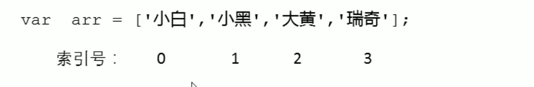
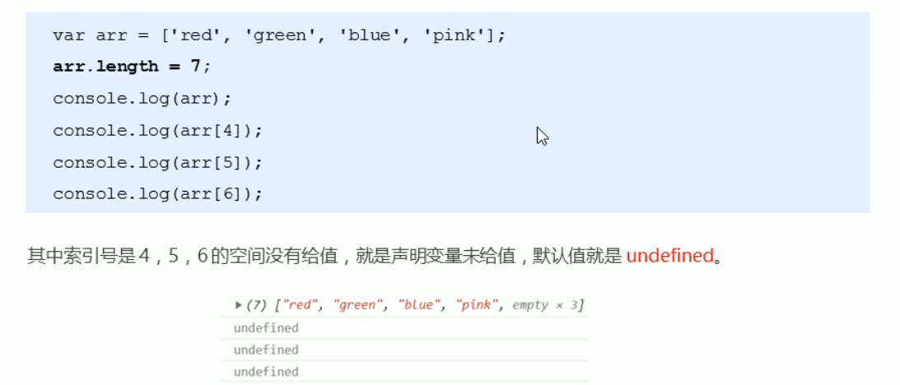
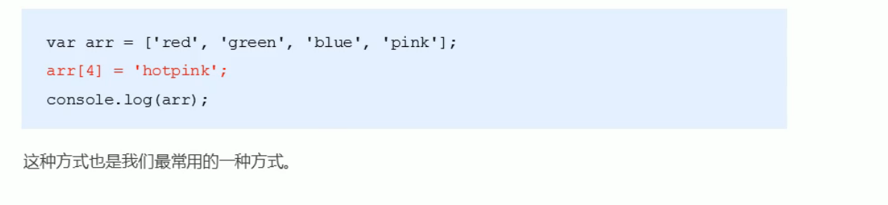

1.数组的概念

- 问:之前学习的变量，只能存储一个值。如果我们想存储班级中所有学生的姓名，那么该如何存储呢?

  答:可以使用数组(Array)。数组可以把一组相关的数据一起存放，并提供方便的访问(获取）方式。

- 问∶什么是数组呢?
  答:数组是指一组数据的集合，其中的每个数据被称作元素，在数组中可以存放任意类型的元素。数组是一种将一组数据存储在单个变量名下的优雅方式。

## 2.创建数组

```js
// 1.数组(Array) ：就是一组数据的集合 存储在单个变量下的优雅方式 
// 2. 利用new 创建数组
var arr = new Array(); // 创建了一个空的数组
// 3. 利用数组字面量创建数组 []
var arr = []; // 创建了一个空的数组
var arr1 = [1, 2, 'pink老师', true];
// 4. 我们数组里面的数据一定用逗号分隔
// 5. 数组里面的数据 比如1,2， 我们称为数组元素
// 6. 获取数组元素  格式 数组名[索引号]  索引号从 0开始 
console.log(arr1);
console.log(arr1[2]); // pink老师
console.log(arr1[3]); // true
var arr2 = ['迪丽热巴', '古丽扎娜', '佟丽丫丫'];
console.log(arr2[0]);
console.log(arr2[1]);
console.log(arr2[2]);
console.log(arr2[3]); // 因为没有这个数组元素 所以输出的结果是 undefined
```

### 2.1数组的创建方式

- JS中创建数组有两种方式:

  - 利用new创建数组

  - 利用数组字面量创建数组

### 2.2利用new创建数组

```js
var 数组名 = new Array();
var arr = new Array(); // 创建一个新的空数组
```

- 这种方式暂且了解，等学完了对象再看
- 注意Array()，要大写

### 2.3利用数组字面量创建数组

```js
// 1．使用数组字面量方式创建空的数组
var数组名 = [];
//2．使用数组字面量方式创建带初始值的数组
var数组名 = ['小白', '小黑', '大黄', '瑞奇'];
```

- 数组的字面量是方括号[]
- 声明数组并赋值称为数组的初始化
- 这种字面量方式也是我们以后最多使用方式

###  2.4数组元素的类型

- 数组中可以存放任意类型的数据，例如字符串，数字，布尔值等。

```js
var arrstus = [ '小',12,true,28.9];
```

## 3.获取数组元素

- 索引（下标）：用来访问数组元素的序号（数组下标从0开始）。



```js
var arr = ['星期一', '星期二', '星期三', '星期四', '星期五', '星期六', '星期日'];
console.log(arr[6]);  //星期日
```

## 4.遍历数组

- 规律：从代码中我们可以发现，从数组中取出每一个元素时，代码是重复的，有所不一样的是索案引值在递增
- 遍历：就是把数组中的每个元素从头到尾都访问一次（类似我们每天早上学生的点名)。

```js
// 遍历数组：就是把数组的元素从头到尾访问一次
var arr = ['red', 'green', 'blue'];
for (var i = 0; i < 3; i++) {
    console.log(arr[i]);
}
// 1. 因为我们的数组索引号从0开始 ，所以 i 必须从 0开始  i < 3
// 2. 输出的时候 arr[i]  i 计数器当索引号来用
```

- 数组长度：数组名.length  动态监测数组元素的个数

```js
// 数组长度 数组名.length
var arr = ['关羽', '张飞', '马超', '赵云', '黄忠', '刘备', '姜维', 'pink'];
console.log(arr.length);
for (var i = 0; i < arr.length; i++) {
    console.log(arr[i]);
}
// 1. 数组的长度是元素个数  不要跟索引号混淆
// 2. arr.length 动态监测数组元素的个数
```

- 案例一（求和以及平均值）

```js
// 1. 求数组 [2,6,1,7, 4] 里面所有元素的和以及平均值。
// (1)声明一个求和变量 sum。
// (2)遍历这个数组，把里面每个数组元素加到 sum 里面。
// (3)用求和变量 sum 除以数组的长度就可以得到数组的平均值。
var arr = [2, 6, 1, 7, 4];
var sum = 0;
var average = 0;
for (var i = 0; i < arr.length; i++) {
    sum += arr[i]; // 我们加的是数组元素 arr[i] 不是计数器 i
}
average = sum / arr.length;
console.log(sum, average); // 想要输出多个变量，用逗号分隔即可
```

- 案例二（求最大值）

```js
// 求数组[2,6,1,77,52,25,7]中的最大值
// 声明一个保存最大元素的变量 max。
// 默认最大值可以取数组中的第一个元素。
// 遍历这个数组，把里面每个数组元素和 max 相比较。
// 如果这个数组元素大于max 就把这个数组元素存到 max 里面，否则继续下一轮比较。
// 最后输出这个 max
var arr = [2, 6, 1, 77, 52, 25, 7, 99];
var max = arr[0];
for (var i = 1; i < arr.length; i++) {
    if (arr[i] > max) {
        max = arr[i];
    }
}
console.log('该数组里面的最大值是：' + max);
```

- 案例三（数组转化为字符串）

```js
// 将数组 ['red', 'green', 'blue', 'pink'] 转换为字符串，并且用 | 或其他符号分割
// 1.需要一个新变量用于存放转换完的字符串 str。
// 2.遍历原来的数组，分别把里面数据取出来，加到字符串里面。
// 3.同时在后面多加一个分隔符
var arr = ['red', 'green', 'blue', 'pink'];
var str = '';
var sep = '*';
for (var i = 0; i < arr.length; i++) {
    str += arr[i] + sep;
}
console.log(str);
```

## 5.数组中新增元素

- 可以通过修改length长度以及索引号增加数组元素

### 5.1通过修改length长度新增数组元素

- 可以通过修改length长度来实现数组扩容的目的

- length属性是可读写的



### 5.2通过修改数组索引新增数组元素

- 可以通过修改数组索引的方式追加数组元素
- 不能直接给数组名赋值，否则会覆盖掉以前的数据



```js
// 1. 新增数组元素 修改length长度 
var arr = ['red', 'green', 'blue'];
console.log(arr.length);
arr.length = 5; // 把我们数组的长度修改为了 5  里面应该有5个元素 
console.log(arr);
console.log(arr[3]); // undefined
console.log(arr[4]); // undefined

// 2. 新增数组元素 修改索引号 追加数组元素
var arr1 = ['red', 'green', 'blue'];
arr1[3] = 'pink';
console.log(arr1);
arr1[4] = 'hotpink';
console.log(arr1);
arr1[0] = 'yellow'; // 这里是替换原来的数组元素
console.log(arr1);
arr1 = '有点意思';
console.log(arr1); // 不要直接给 数组名赋值 否则里面的数组元素都没有了
```

## 6.数组案例

- 案例一（数组存放1~10）

```js
// 新建一个数组，里面存放10个整数（ 1~10）
// 核心原理：使用循环来追加数组。
// 1、声明一个空数组 arr。
// 2、循环中的计数器 i  可以作为数组元素存入。
// 3、由于数组的索引号是从0开始的， 因此计数器从 0 开始更合适，存入的数组元素要+1。
var arr = [];
for (var i = 0; i < 10; i++) {
    // arr = i; 不要直接给数组名赋值 否则以前的元素都没了
    arr[i] = i + 1;
}
console.log(arr);
```

-   案例二（筛选数组）

```js
// 将数组 [2, 0, 6, 1, 77, 0, 52, 0, 25, 7] 中大于等于 10 的元素选出来，放入新数组。
// 1、声明一个新的数组用于存放新数据newArr。
// 2、遍历原来的旧数组， 找出大于等于 10 的元素。
// 3、依次追加给新数组 newArr。
// 方法1==============================================
var arr = [2, 0, 6, 1, 77, 0, 52, 0, 25, 7];
var newArr = [];
var j = 0;
for (var i = 0; i < arr.length; i++) {
    if (arr[i] >= 10) {
        // 新数组索引号应该从0开始 依次递增
        newArr[j] = arr[i];
        j++;
    }
}
console.log(newArr);
// 方法2 ===============================================
var arr = [2, 0, 6, 1, 77, 0, 52, 0, 25, 7];
var newArr = [];
// 刚开始 newArr.length 就是 0
for (var i = 0; i < arr.length; i++) {
    if (arr[i] >= 10) {
        // 新数组索引号应该从0开始 依次递增
        newArr[newArr.length] = arr[i];
    }
}
console.log(newArr);
```

- 案例三 (数组去重)

```js
   // 将数组[2, 0, 6, 1, 77, 0, 52, 0, 25, 7]中的 0 去掉后，形成一个不包含 0 的新数组。
        // 1、需要一个新数组用于存放筛选之后的数据。
        // 2、遍历原来的数组， 把不是 0 的数据添加到新数组里面(此时要注意采用数组名 + 索引的格式接收数据)。
        // 3、新数组里面的个数， 用 length 不断累加。
        var arr = [2, 0, 6, 1, 77, 0, 52, 0, 25, 7];
        var newArr = [];
        for (var i = 0; i < arr.length; i++) {
            if (arr[i] != 0) {
                newArr[newArr.length] = arr[i];
            }
        }
```

- 案例四 (翻转数组)

```js
// 将数组 ['red', 'green', 'blue', 'pink', 'purple'] 的内容反过来存放
// 1、声明一个新数组 newArr
// 2、把旧数组索引号第4个取过来（arr.length - 1)，给新数组索引号第0个元素 (newArr.length)
// 3、我们采取 递减的方式  i--
var arr = ['red', 'green', 'blue', 'pink', 'purple', 'hotpink'];
var newArr = [];
for (var i = arr.length - 1; i >= 0; i--) {
    newArr[newArr.length] = arr[i]
}
console.log(newArr);

//自己的方法
var arr = ['red', 'green', 'blue', 'pink', 'purple'];
var newArr = [];
for (i = 0; i < arr.length; i++) {
    newArr[newArr.length] = arr[arr.length-1-i];
}
console.log(newArr);
```

- 案例五 (数组排序)(冒泡排序)

```js
// 冒泡排序
// var arr = [5, 4, 3, 2, 1];
var arr = [4, 1, 2, 3, 5];
for (var i = 0; i <= arr.length - 1; i++) { // 外层循环管趟数 
    for (var j = 0; j <= arr.length - i - 1; j++) { // 里面的循环管 每一趟的交换次数
        // 内部交换2个变量的值 前一个和后面一个数组元素相比较
        if (arr[j] < arr[j + 1]) {
            var temp = arr[j];
            arr[j] = arr[j + 1];
            arr[j + 1] = temp;
        }

    }
}
```

