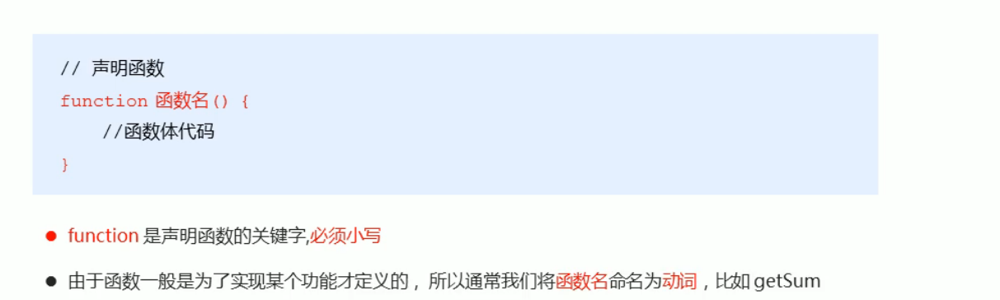
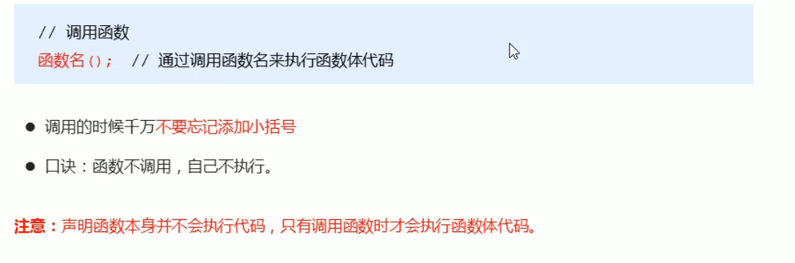
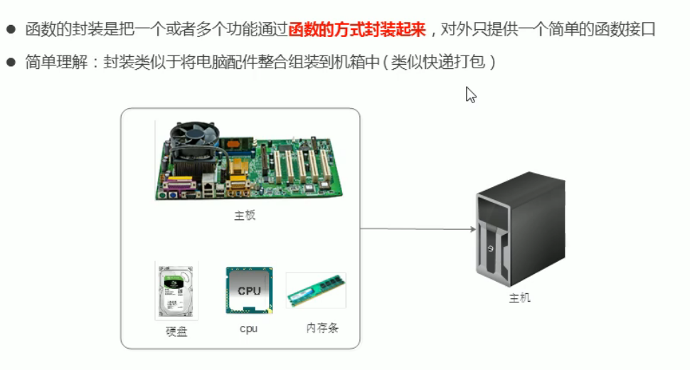
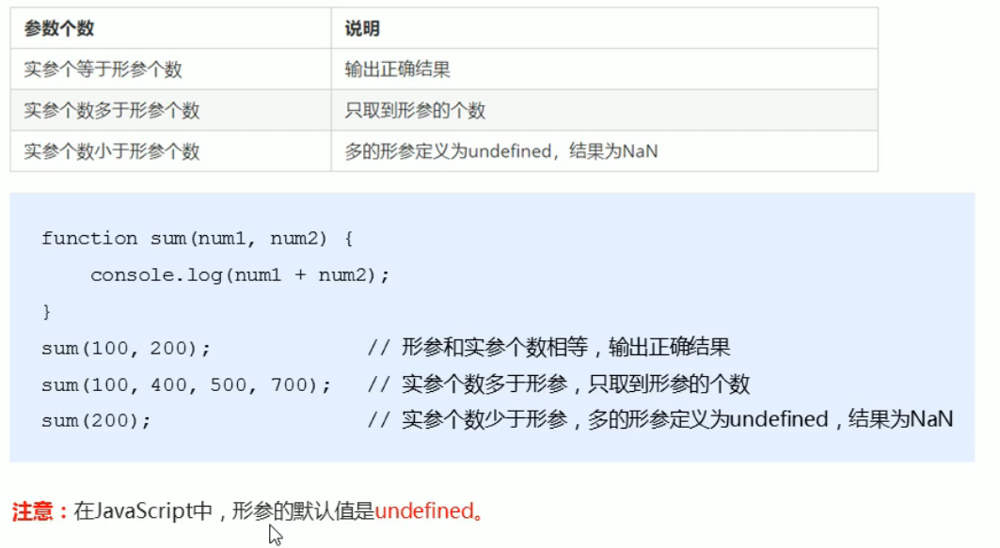

## 1-函数的概念

虽然for循环语句也能实现一些简单的重复操作，但是比较具有局限性，此时我们就可以使用JS中的函数。

在JS里面，可能会定义非常多的相同代码或者功能相似的代码，.这些代码可能需要大量重复使用。

- 函数∶就是封装了一段可被重复调用执行的代码块。通过此代码块可以实现大量代码的重复使用。

## 2-函数的使用

- 函数使用分为两步： 声明函数 和 调用函数

### 2.1-声明函数



### 2.2-调用函数



### 2.3-函数封装



```js
// 函数使用分为两步： 声明函数 和 调用函数
// 1. 声明函数
// function 函数名() {
//     // 函数体
// }
function sayHi() {
    console.log('hi~~');

}
// (1) function 声明函数的关键字 全部小写
// (2) 函数是做某件事情，函数名一般是动词 sayHi 
// (3) 函数不调用自己不执行
// 2. 调用函数
// 函数名();
sayHi();
// 调用函数的时候千万不要忘记加小括号
```

- 利用函数封装求1~100的和

```js
// 利用函数计算1-100之间的累加和 
// 1. 声明函数
function getSum() {
    var sum = 0;
    for (var i = 1; i <= 100; i++) {
        sum += i;
    }
    console.log(sum);

}
// 2. 调用函数
getSum();
```

## 3-函数的参数

### 3.1行参和实参

- 在声明函数时，可以在函数名称后面的小括号中添加一些参数，这些参数被称为形参，而在调用该函数时,同样也需要传递相应的参数，这些参数被称为实参。

| 参数 | 说明                                                   |
| ---- | ------------------------------------------------------ |
| 行参 | 形式上的参数函数定义的时候传递的参数当前并不知道是什么 |
| 实参 | 实际上的参数函数调用的时候传递的参数实参是传递给形参的 |

- 参数的作用:在函数内部某些值不能固定，我们可以通过参数在调用函数时传递不同的值进去。

```js
// 1. 函数可以重复相同的代码
function cook() {
    console.log('酸辣土豆丝');
}
 cook();
// 2. 我们可以利用函数的参数实现函数重复不同的代码
// function 函数名(形参1,形参2...) { // 在声明函数的小括号里面是 形参 （形式上的参数）

// }
// 函数名(实参1,实参2...); // 在函数调用的小括号里面是实参（实际的参数）
// 3. 形参和实参的执行过程
function cook(aru) { // 形参是接受实参的  aru = '酸辣土豆丝' 形参类似于一个变量
    console.log(aru);
}
cook('酸辣土豆丝');
cook('大肘子');
// 4. 函数的参数可以有，也可以没有个数不限
```

- 案例 
  - (求和)
  - (求之间数的和)

```js
// 1. 利用函数求任意两个数的和
function getSum(num1, num2) {
    console.log(num1 + num2);

}
getSum(1, 3);
getSum(3, 8);
// 2. 利用函数求任意两个数之间的和
function getSums(start, end) {
    var sum = 0;
    for (var i = start; i <= end; i++) {
        sum += i;
    }
    console.log(sum);

}
getSums(1, 100);
getSums(1, 10);
// 3. 注意点
// (1) 多个参数之间用逗号隔开
// (2) 形参可以看做是不用声明的变量
```

### 3.4-函数形参实参个数匹配



### 3.5-小结

- 函数可以带参数也可以不带参数
- 声明函数的时候，函数名括号里面的是形参，形参的默认值为undefined
- 调用函数的时候，函数名括号里面的是实参
- 多个参数中间用逗号分隔
- 形参的个数可以和实参个数不匹配，但是结果不可预计，我们尽量要匹配

```js
// 函数形参实参个数匹配
function getSum(num1, num2) {
    console.log(num1 + num2);

}
// 1. 如果实参的个数和形参的个数一致 则正常输出结果
getSum(1, 2);
// 2. 如果实参的个数多于形参的个数  会取到形参的个数 
getSum(1, 2, 3);
// 3. 如果实参的个数小于形参的个数  多于的形参定义为undefined  最终的结果就是 NaN
// 形参可以看做是不用声明的变量  num2 是一个变量但是没有接受值  结果就是undefined 
getSum(1); // NaN
// 建议 我们尽量让实参的个数和形参相匹配
```

## 4-函数的返回值

### 4.1-return

```js
// 1.函数是做某件事或者实现某种功能
// function cook(aru) {
//     console.log(aru);

// }
// cook('大肘子');
// 2. 函数的返回值格式
// function 函数名() {
//     return 需要返回的结果;
// }
// 函数名();
// (1) 我们函数只是实现某种功能，最终的结果需要返回给函数的调用者函数名() 通过return 实现的
// (2) 只要函数遇到return 就把后面的结果 返回给函数的调用者  函数名() = return后面的结果
// 3. 代码验证
function getResult() {
    return 666;
}
getResult(); // getResult()   = 666
console.log(getResult());

// function cook(aru) {
//     return aru;
// }
// console.log(cook('大肘子'));
// 4. 求任意两个数的和
function getSum(num1, num2) {
    return num1 + num2;
}
console.log(getSum(1, 2));
```

- 案例一 (利用函数 求两个数的最大值)

```js
// 利用函数 求两个数的最大值
function getMax(num1, num2) {
    // if (num1 > num2) {
    //     return num1;
    // } else {
    //     return num2;
    // }
    return num1 > num2 ? num1 : num2;
}
console.log(getMax(1, 3));
```

- 案例二 求数组中的最大值(函数版)

```js
// 利用函数求数组 [5,2,99,101,67,77] 中的最大数值。
function getArrMax(arr) { // arr 接受一个数组  arr =  [5,2,99,101,67,77]
    var max = arr[0];
    for (var i = 1; i <= arr.length; i++) {
        if (arr[i] > max) {
            max = arr[i];
        }
    }
    return max;
}
// getArrMax([5, 2, 99, 101, 67, 77]); // 实参是一个数组送过去
// 在我们实际开发里面，我们经常用一个变量来接受 函数的返回结果 使用更简单
// var re = getArrMax([5, 2, 99, 101, 67, 77]);
var re = getArrMax([3, 77, 44, 99, 143]);
console.log(re);
```

- 在我们实际开发里面，我们经常用一个变量来接受 函数的返回结果 使用更简单

### 4.2return终止函数

- return语句后面的代码不会被执行

```js
// 1. return 终止函数
function getSum(num1, num2) {
    return num1 + num2; // return 后面的代码不会被执行
    alert('我是不会被执行的哦！')
}
console.log(getSum(1, 2));
```

### 4.3return的返回值

- return只能返回一个值。如果用逗号隔开多个值，以最后一个为准。

```js
// 2. return 只能返回一个值
function fn(num1, num2) {
    return num1, num2; // 返回的结果是最后一个值
}
console.log(fn(1, 2));
```

```js
// 3.  我们求任意两个数的 加减乘数结果
function getResult(num1, num2) {
    return [num1 + num2, num1 - num2, num1 * num2, num1 / num2];
}
var re = getResult(1, 2); // 返回的是一个数组
console.log(re);
```

### 4.4函数没有 return返回 undefined

- 函数都是有返回值的
  1. 如果有`return`则返回`return`后面的值
  2. 如果没有`return`则返回`undefined`

````js
// 4. 我们的函数如果有return 则返回的是 return 后面的值，如果函数么有 return 则返回undefined
function fun1() {
    return 666;
}
console.log(fun1()); // 返回 666
function fun2() {
}
console.log(fun2()); // 函数返回的结果是 undefined
````

### 4.5 break ,continue ,return的区别

- break: 结束当前的循环体(如for、while )
- continue: 跳出本次循环，继续执行下次循环（如for、while )
- return: 不仅可以退出循环，还能够返回return语句中的值，同时还可以结束当前的函数体内的代码

## 5-arguments使用

- 当我们不确定有多少个参数传递的时候，可以用arguments来获取。在JavaScript中，arguments实际上它是当前函数的一个内置对象。所有函数都内置了一个arguments对象，arguments对象中存储了传递的所有实参。

```js
// arguments 的使用  只有函数才有 arguments对象  而且是每个函数都内置好了这个arguments
function fn() {
    // console.log(arguments); // 里面存储了所有传递过来的实参  arguments = [1,2,3]
    // console.log(arguments.length);
    // console.log(arguments[2]);
    // 我们可以按照数组的方式遍历arguments
    for (var i = 0; i < arguments.length; i++) {
        console.log(arguments[i]);

    }
}
fn(1, 2, 3);
fn(1, 2, 3, 4, 5);
// 伪数组 并不是真正意义上的数组
// 1. 具有数组的 length 属性
// 2. 按照索引的方式进行存储的
// 3. 它没有真正数组的一些方法 pop()  push() 等等
```

## 6-案例练习

- 案例一(最大值)

```js
// 利用函数求任意个数的最大值
function getMax() { // arguments = [1,2,3]
    var max = arguments[0];
    for (var i = 1; i < arguments.length; i++) {
        if (arguments[i] > max) {
            max = arguments[i];
        }
    }
    return max;
}
console.log(getMax(1, 2, 3));
console.log(getMax(1, 2, 3, 4, 5));
console.log(getMax(11, 2, 34, 444, 5, 100));
```

- 案例二(翻转数组)

```js
// 利用函数翻转任意数组 reverse 翻转
function reverse(arr) {
    var newArr = [];
    for (var i = arr.length - 1; i >= 0; i--) {
        newArr[newArr.length] = arr[i];
    }
    return newArr;
}
var arr1 = reverse([1, 3, 4, 6, 9]);
console.log(arr1);
var arr2 = reverse(['red', 'pink', 'blue']);
console.log(arr2);
```

- 案例三(冒泡排序)

```js
// 利用函数冒泡排序 sort 排序
function sort(arr) {
    for (var i = 0; i < arr.length - 1; i++) {
        for (var j = 0; j < arr.length - i - 1; j++) {
            if (arr[j] > arr[j + 1]) {
                var temp = arr[j];
                arr[j] = arr[j + 1];
                arr[j + 1] = temp;
            }
        }
    }
    return arr;
}
var arr1 = sort([1, 4, 2, 9]);
console.log(arr1);
var arr2 = sort([11, 7, 22, 999]);
console.log(arr2);
```

- 案例四(判断平年闰年)

```js
// 利用函数判断闰年
function isRunYear(year) {
    // 如果是闰年我们返回 true  否则 返回 false 
    var flag = false;
    if (year % 4 == 0 && year % 100 != 0 || year % 400 == 0) {
        flag = true;
    }
    return flag;
}
console.log(isRunYear(2000));
console.log(isRunYear(1999));
```

### 6.1-函数可以代用另外一个函数

- 因为每个函数都是独立的代码块，用于完成特殊任务，因此经常会用到函数相互调用的情况。

```js
function fn1() {
    console.log(111);
    fn2();
    console.log('fn1');
}

function fn2() {
    console.log(222);
    console.log('fn2');
}
fn1();
```

- 案例五 (用户输入年份，输出当前年份2月份的天数)

```js
// 用户输入年份，输出当前年份2月份的天数
function backDay() {
    var year = prompt('请您输入年份:');
    if (isRunYear(year)) { // 调用函数需要加小括号
        alert('当前年份是闰年2月份有29天');
    } else {
        alert('当前年份是平年2月份有28天');
    }
}
backDay();


// 判断是否为闰年的函数
function isRunYear(year) {
    // 如果是闰年我们返回 true  否则 返回 false 
    var flag = false;
    if (year % 4 == 0 && year % 100 != 0 || year % 400 == 0) {
        flag = true;
    }
    return flag;
}
```

### 6.2-函数的两种声明方式

```js
// 函数的2中声明方式
// 1. 利用函数关键字自定义函数(命名函数)
function fn() {

}
fn();
// 2. 函数表达式(匿名函数) 
// var 变量名 = function() {};
var fun = function(aru) {
    console.log('我是函数表达式');
    console.log(aru);

}
fun('pink老师');
// (1) fun是变量名 不是函数名  
// (2) 函数表达式声明方式跟声明变量差不多，只不过变量里面存的是值 而 函数表达式里面存的是函数
// (3) 函数表达式也可以进行传递参数
```

