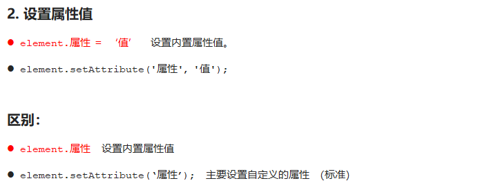
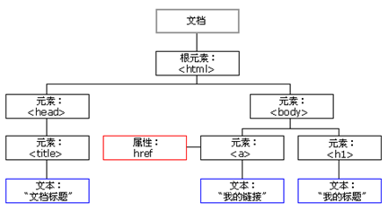
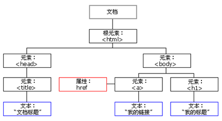
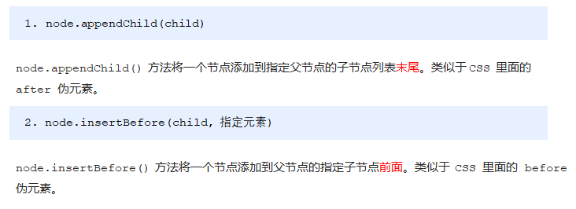

## day02 - Web APIs

> 学习目标：
>
> 能够说出排他操作的一般实现步骤
>
> 能够使用html5中的dataset方式操作自定义属性
>
> 能够根据提示完成百度换肤的案例
>
> 能够根据提示完成全选案例
>
> 能够根据提示完成tab栏切换案例
>
> 能够区分元素节点、文本节点、属性节点
>
> 能够获取指定元素的父元素
>
> 能够获取指定元素的所有子元素
>
> 能够说出childNodes和children的区别
>
> 能够使用createElement创建页面元素

## 1. 排他操作

### 1.1 排他思想


如果有同一组元素，我们想要某一个元素实现某种样式， 需要用到循环的排他思想算法：

1. 所有元素全部清除样式（干掉其他人）

2. 给当前元素设置样式 （留下我自己）

3. 注意顺序不能颠倒，首先干掉其他人，再设置自己

```html
<button>按钮1</button>
<button>按钮2</button>
<button>按钮3</button>
<button>按钮4</button>
<button>按钮5</button>
<script>
    // 1. 获取所有按钮元素
    var btns = document.getElementsByTagName('button');
    // btns得到的是伪数组  里面的每一个元素 btns[i]
    for (var i = 0; i < btns.length; i++) {
        btns[i].onclick = function() {
            // (1) 我们先把所有的按钮背景颜色去掉  干掉所有人
            for (var i = 0; i < btns.length; i++) {
                btns[i].style.backgroundColor = '';
            }
            // (2) 然后才让当前的元素背景颜色为pink 留下我自己
            this.style.backgroundColor = 'pink';

        }
    }
    //2. 首先先排除其他人，然后才设置自己的样式 这种排除其他人的思想我们成为排他思想
</script>
```


## 2 案例：百度换肤


```html
<body>
    <ul class="baidu">
        <li></li>
        <li></li>
        <li></li>
        <li></li>
    </ul>
    <script>
        // 1. 获取元素 
        var imgs = document.querySelector('.baidu').querySelectorAll('img');
        // console.log(imgs);
        // 2. 循环注册事件 
        for (var i = 0; i < imgs.length; i++) {
            imgs[i].onclick = function() {
                // this.src 就是我们点击图片的路径   images/2.jpg
                // console.log(this.src);
                // 把这个路径 this.src 给body 就可以了
                document.body.style.backgroundImage = 'url(' + this.src + ')';
            }
        }
    </script>
</body>
```

## 3 案例：表格隔行变色


```html
<script>
    // 1.获取元素 获取的是 tbody 里面所有的行
    var trs = document.querySelector('tbody').querySelectorAll('tr');
    // 2. 利用循环绑定注册事件
    for (var i = 0; i < trs.length; i++) {
        // 3. 鼠标经过事件 onmouseover
        trs[i].onmouseover = function() {
            // console.log(11);
            this.className = 'bg';
        }
        // 4. 鼠标离开事件 onmouseout
        trs[i].onmouseout = function() {
            this.className = '';
        }
    }
</script>
```

## 4 案例：全选


```html
<script>
    // 1. 全选和取消全选做法：  让下面所有复选框的checked属性（选中状态） 跟随 全选按钮即可
    // 获取元素
    var j_cbAll = document.getElementById('j_cbAll'); // 全选按钮
    var j_tbs = document.getElementById('j_tb').getElementsByTagName('input'); // 下面所有的复选框
    // 注册事件
    j_cbAll.onclick = function() {
        // this.checked 它可以得到当前复选框的选中状态如果是true 就是选中，如果是false 就是未选中
        console.log(this.checked);
        for (var i = 0; i < j_tbs.length; i++) {
            j_tbs[i].checked = this.checked;
        }
    }
    // 2. 下面复选框需要全部选中， 上面全选才能选中做法： 给下面所有复选框绑定点击事件，每次点击，都要循环查看下面所有的复选框是否有没选中的，如果有一个没选中的， 上面全选就不选中。
    for (var i = 0; i < j_tbs.length; i++) {
        j_tbs[i].onclick = function() {
            // flag 控制全选按钮是否选中
            var flag = true;
            // 每次点击下面的复选框都要循环检查者4个小按钮是否全被选中
            for (var i = 0; i < j_tbs.length; i++) {
                if (!j_tbs[i].checked) {
                    flag = false;
                    break; // 退出for循环 这样可以提高执行效率 因为只要有一个没有选中，剩下的就无需循环判断了
                }
            }
            j_cbAll.checked = flag;
        }
    }
</script>
```


## 5. 自定义属性操作

### 5.1 获取属性值


```js
    <div id="demo" index="1" class="nav"></div>
    <script>
        var div = document.querySelector('div');
        // 1. 获取元素的属性值
        // (1) element.属性
        console.log(div.id);
        //(2) element.getAttribute('属性')  get得到获取 attribute 属性的意思 我们程序员自己添加的属性我们称为自定义属性 index
        console.log(div.getAttribute('id'));
        console.log(div.getAttribute('index'));
	</script>
```


### 5.2. 设置属性值



```js
        // 2. 设置元素属性值
        // (1) element.属性= '值'
        div.id = 'test';
        div.className = 'navs';
        // (2) element.setAttribute('属性', '值');  主要针对于自定义属性
        div.setAttribute('index', 2);
        div.setAttribute('class', 'footer'); // class 特殊  这里面写的就是
```


### 5.3. 移出属性


```js
		// class 不是className
        // 3 移除属性 removeAttribute(属性)    
        div.removeAttribute('index');
```


### 5.4. 案例：tab栏


```js
    <script>
        // 获取元素
        var tab_list = document.querySelector('.tab_list');
        var lis = tab_list.querySelectorAll('li');
        var items = document.querySelectorAll('.item');
        // for循环，给选项卡绑定点击事件
        for (var i = 0; i < lis.length; i++) {
            // 开始给5个小li 设置索引号 
            lis[i].setAttribute('index', i);
            lis[i].onclick = function() {
                // 1. 上的模块选项卡，当前这一个底色会是红色，其余不变（排他思想）
                // 干掉所有人 其余的li清除 class 这个类
                for (var i = 0; i < lis.length; i++) {
                    lis[i].className = '';
                }
                // 留下我自己 
                this.className = 'current';
                // 2. 下面的显示内容模块
                var index = this.getAttribute('index');
                console.log(index);
                // 干掉所有人 让其余的item 这些div 隐藏
                for (var i = 0; i < items.length; i++) {
                    items[i].style.display = 'none';
                }
                // 留下我自己 让对应的item 显示出来
                items[index].style.display = 'block';
            }
        }
    </script>
```


### 5.5. H5自定义属性

自定义属性目的：是为了保存并使用数据。有些数据可以保存到页面中而不用保存到数据库中。

自定义属性获取是通过getAttribute(‘属性’) 获取。

但是有些自定义属性很容易引起歧义，不容易判断是元素的内置属性还是自定义属性。

H5给我们新增了自定义属性：


```js
    <div getTime="20" data-index="2" data-list-name="andy"></div>
    <script>
        var div = document.querySelector('div');
        // console.log(div.getTime);
        console.log(div.getAttribute('getTime'));
        div.setAttribute('data-time', 20);
        console.log(div.getAttribute('data-index'));
        console.log(div.getAttribute('data-list-name'));
        // h5新增的获取自定义属性的方法 它只能获取data-开头的
        // dataset 是一个集合里面存放了所有以data开头的自定义属性
        console.log(div.dataset);
        console.log(div.dataset.index);
        console.log(div.dataset['index']);
        // 如果自定义属性里面有多个-链接的单词，我们获取的时候采取 驼峰命名法
        console.log(div.dataset.listName);
        console.log(div.dataset['listName']);
    </script>
```


## 6. 节点操作

### 6.1. 节点概述

​	网页中的所有内容都是节点（标签、属性、文本、注释等），在DOM 中，节点使用 node 来表示。

​	HTML DOM 树中的所有节点均可通过 JavaScript 进行访问，所有 HTML 元素（节点）均可被修改，也可以创建或删除。



​	一般地，节点至少拥有nodeType（节点类型）、nodeName（节点名称）和nodeValue（节点值）这三个基本属性。


### 6.2. 节点层级

​	利用 DOM 树可以把节点划分为不同的层级关系，常见的是**父子兄层级关系**。

​    

### 6.3. 父级节点


```js
    <div class="demo">
        <div class="box">
            <span class="erweima">×</span>
        </div>
    </div>
    <script>
        // 1. 父节点 parentNode
        var erweima = document.querySelector('.erweima');
        // var box = document.querySelector('.box');
        // 得到的是离元素最近的父级节点(亲爸爸) 如果找不到父节点就返回为 null
        console.log(erweima.parentNode);
    </script>
```

### 6.4. 子节点

**所有子节点**


**子元素节点**


```js
    <ul>
        <li>我是li</li>
        <li>我是li</li>
        <li>我是li</li>
        <li>我是li</li>
    </ul>
    <script>
        // DOM 提供的方法（API）获取
        var ul = document.querySelector('ul');
        var lis = ul.querySelectorAll('li');
        // 1. 子节点  childNodes 所有的子节点 包含 元素节点 文本节点等等
        console.log(ul.childNodes);
        console.log(ul.childNodes[0].nodeType);
        console.log(ul.childNodes[1].nodeType);
        // 2. children 获取所有的子元素节点 也是我们实际开发常用的
        console.log(ul.children);
    </script>
```

**第1个子节点**


**最后1个子节点**


**第1个子元素节点**


**最后1个子元素节点**


​	实际开发中，firstChild 和 lastChild 包含其他节点，操作不方便，而 firstElementChild 和 lastElementChild 又有兼容性问题，那么我们如何获取第一个子元素节点或最后一个子元素节点呢？


```js
    <ol>
        <li>我是li1</li>
        <li>我是li2</li>
        <li>我是li3</li>
        <li>我是li4</li>
        <li>我是li5</li>
    </ol>
    <script>
        var ol = document.querySelector('ol');
        // 1. firstChild 第一个子节点 不管是文本节点还是元素节点
        console.log(ol.firstChild);
        console.log(ol.lastChild);
        // 2. firstElementChild 返回第一个子元素节点 ie9才支持
        console.log(ol.firstElementChild);
        console.log(ol.lastElementChild);
        // 3. 实际开发的写法  既没有兼容性问题又返回第一个子元素
        console.log(ol.children[0]);
        console.log(ol.children[ol.children.length - 1]);
    </script>
```

### 6.5. 案例：新浪下拉菜单


```js
    <script>
        // 1. 获取元素
        var nav = document.querySelector('.nav');
        var lis = nav.children; // 得到4个小li
        // 2.循环注册事件
        for (var i = 0; i < lis.length; i++) {
            lis[i].onmouseover = function() {
                this.children[1].style.display = 'block';
            }
            lis[i].onmouseout = function() {
                this.children[1].style.display = 'none';
            }
        }
    </script>
```

### 6.6. 兄弟节点

**下一个兄弟节点**


**上一个兄弟节点**


```js
    <div>我是div</div>
    <span>我是span</span>
    <script>
        var div = document.querySelector('div');
        // 1.nextSibling 下一个兄弟节点 包含元素节点或者 文本节点等等
        console.log(div.nextSibling);
        console.log(div.previousSibling);
        // 2. nextElementSibling 得到下一个兄弟元素节点
        console.log(div.nextElementSibling);
        console.log(div.previousElementSibling);
    </script>
```

**下一个兄弟元素节点（有兼容性问题）**


**上一个兄弟元素节点（有兼容性问题）**


```js
   function getNextElementSibling(element) {
      var el = element;
      while (el = el.nextSibling) {
        if (el.nodeType === 1) {
            return el;
        }
      }
      return null;
    }  
```

### 1.6.7. 创建节点


### 1.6.8. 添加节点



```js
    <ul>
        <li>123</li>
    </ul>
    <script>
        // 1. 创建节点元素节点
        var li = document.createElement('li');
        // 2. 添加节点 node.appendChild(child)  node 父级  child 是子级 后面追加元素
        var ul = document.querySelector('ul');
        ul.appendChild(li);
        // 3. 添加节点 node.insertBefore(child, 指定元素);
        var lili = document.createElement('li');
        ul.insertBefore(lili, ul.children[0]);
        // 4. 我们想要页面添加一个新的元素 ： 1. 创建元素 2. 添加元素
    </script>
```

### 1.6.9. 案例：简单版发布留言


```js
<body>
    <textarea name="" id=""></textarea>
    <button>发布</button>
    <ul>

    </ul>
    <script>
        // 1. 获取元素
        var btn = document.querySelector('button');
        var text = document.querySelector('textarea');
        var ul = document.querySelector('ul');
        // 2. 注册事件
        btn.onclick = function() {
            if (text.value == '') {
                alert('您没有输入内容');
                return false;
            } else {
                // console.log(text.value);
                // (1) 创建元素
                var li = document.createElement('li');
                // 先有li 才能赋值
                li.innerHTML = text.value;
                // (2) 添加元素
                // ul.appendChild(li);
                ul.insertBefore(li, ul.children[0]);
            }
        }
    </script>
</body>
```

